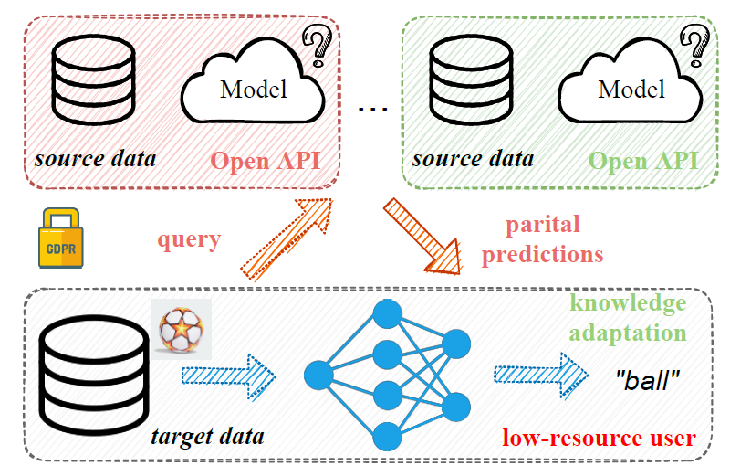
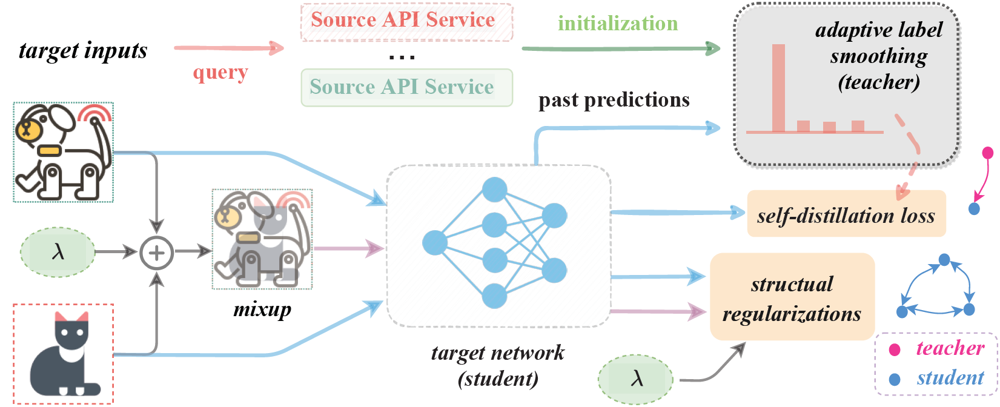
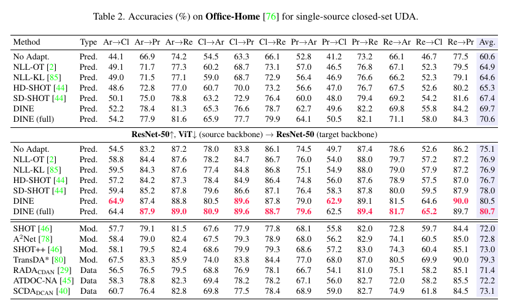

# Official implementation for **DINE**

## [**DINE: Domain Adaptation from Single and Multiple Black-box Predictors**](https://arxiv.org/abs/2104.01539)

### Problem setting (Black-box UDA):  

### Our framework (Distill-and-Finetune):  

### Prerequisites:
- python == 3.6.8
- cudatoolkit == 11.0
- pytorch ==1.7.1
- torchvision == 0.8.2
- numpy, scipy, sklearn, PIL, argparse, tqdm

### Demo:

- [ ] Configure the pytorch environment

- [ ] Download the dataset and write the correspinding text files via https://github.com/tim-learn/Generate_list  (check the file path in the 'data/office-home/**_list.txt' folder)

- [ ] Run the following code (**reproduce the results for ResNet-50 (source backbone) -> ResNet-50 (target backbone) in upper Table 2**) 

   - training the source model first

     > python DINE_dist.py  --gpu_id 0 --seed 2021 --output_src ./ckps/src --dset office-home --s 0 --da uda --net_src resnet50 --max_epoch 50

   - the first step (Distill)

     > python DINE_dist.py  --gpu_id 0 --seed 2021 --output_src ./ckps/src --dset office-home --s 0 --da uda --net_src resnet50 --max_epoch 30 --net resnet50  --output ./ckps/tar --distill --topk 1
   - the second step (Finetune)
     
     > python DINE_ft.py    --gpu_id 0 --seed 2021  --dset office-home --s 0 --da uda --net_src resnet50 --max_epoch 30 --net resnet50  --lr 1e-2 --output ./ckps/tar

### Results:  

### Citation

If you find this code useful for your research, please cite our paper

> @article{liang2021dine,  
> &nbsp; &nbsp;  title={DINE: Domain Adaptation from Single and Multiple Black-box Predictors},  
> &nbsp; &nbsp;  author={Liang, Jian and Hu, Dapeng and Feng, Jiashi and He, Ran},  
> &nbsp; &nbsp;  journal={arxiv preprint arXiv: 2104.01539V2},   
> &nbsp; &nbsp;  year={2021}  
> }

### Contact

- [liangjian92@gmail.com](liangjian92@gmail.com)
